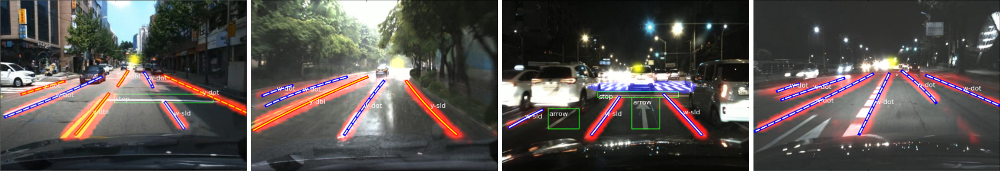

# VPGNet: Vanishing Point Guided Network for Lane and Road Marking Detection and Recognition

<center><strong><em>International Conference on Computer Vision (ICCV) 2017</em></strong></center>

<center></center>

<div style="text-align: justify">
In this paper, we propose a unified end-to-end trainable multi-task network that jointly handles lane and road marking detection and recognition that is guided by a vanishing point under adverse weather conditions. We tackle rainy and low illumination conditions, which have not been extensively studied until now due to clear challenges. For example, images taken under rainy days are subject to low illumination, while wet roads cause light reflection and distort the appearance of lane and road markings. At night, color distortion occurs under limited illumination. As a result, no benchmark dataset exists and only a few developed algorithms work under poor weather conditions. To address this shortcoming, we build up a lane and road marking benchmark which consists of about 20,000 images with 17 lane and road marking classes under four different scenarios: no rain, rain, heavy rain, and night. We train and evaluate several versions of the proposed multi-task network and validate the importance of each task. The resulting approach, VPGNet, can detect and classify lanes and road markings, and predict a vanishing point with a single forward pass. Experimental results show that our approach achieves high accuracy and robustness under various conditions in real-time (20 fps).
</div>

## Supplementary Video
+ https://www.youtube.com/watch?v=jnewRlt6UbI


## Citation
+ Please cite [VPGNet](http://openaccess.thecvf.com/content_iccv_2017/html/Lee_VPGNet_Vanishing_Point_ICCV_2017_paper.html) in your publications if it helps your research:
    
    @InProceedings{Lee_2017_ICCV,
      author = {Lee, Seokju and Kim, Junsik and Shin Yoon, Jae and Shin, Seunghak and Bailo, Oleksandr and Kim, Namil and Lee, Tae-Hee and Seok Hong, Hyun and Han, Seung-Hoon and So Kweon, In},
      title = {VPGNet: Vanishing Point Guided Network for Lane and Road Marking Detection and Recognition},
      booktitle = {The IEEE International Conference on Computer Vision (ICCV)},
      month = {Oct},
      year = {2017}
    }


## Baseline Usage
1. Clone the repository

    ```
    git clone https://github.com/SeokjuLee/VPGNet.git
    ```

2. Prepare dataset from Caltech Lanes Dataset.<br/>
    - Download [Caltech Lanes Dataset](http://www.mohamedaly.info/datasets/caltech-lanes).
    - Organize the file structure as below.
    ```
    |__ VPGNet
        |__ caffe
        |__ caltech-lanes-dataset
            |__ caltech-lane-detection/matlab
            |__ cordova1
            |__ cordova2
            |__ washington1
            |__ washington2
            |__ vpg_annot_v1.m
    ```
    - Generate list files using 'caltech-lanes-dataset/vpg_annot_v1.m'. Arrange training and validation sets as you wish. 

3. Caffe compliation
    - Compile our Caffe codes following the [instructions](https://caffe.berkeleyvision.org/installation.html).
    - Go to our workspace.
    ```cd caffe/models/vpgnet-novp```

4. Make LMDB
    - Change paths in ```make_lmdb.sh``` and run it. The LMDB files would be created.
    
5. Training
    - Run ```train.sh```


## VPGNet Dataset
1. Download
	- If you would like to download the VPGNet dataset, please fill out a [survey](https://forms.gle/LNCPUgEu4B7XGjLZA). We will send you an e-mail with a download link.

2. Dataset overview
    - We categorize the scenes according to the time of the day and weather conditions (Please check our [paper](http://openaccess.thecvf.com/content_iccv_2017/html/Lee_VPGNet_Vanishing_Point_ICCV_2017_paper.html)).
    ```
	scene_1: daytime, no rain
	scene_2: daytime, rain
	scene_3: daytime, heavy rain
	scene_4: night
	```
    - File structure
    ```
    |__ VPGNet-DB-5ch
        |__ scene_1
            |__ $TIMESTAMP
            	|__ $FRAMEIDX.mat
        |__ scene_2
        |__ scene_3
        |__ scene_4
    ```

3. Formatting
    - We parse 640x480 RGB image (3ch), segmentation (1ch), and vanishing point (1ch) labels into a blob of 5 channels as a $FRAMEIDX.mat (MATLAB) file.
    - For class labels, please refer to [vpgnet-labels](https://github.com/SeokjuLee/VPGNet/blob/master/vpgnet-labels.txt).

4. Visualization
	- To visualize our dataset, please refer to [LaneDatasetInspector](https://github.com/eeyrw/LaneDatasetInspector).
